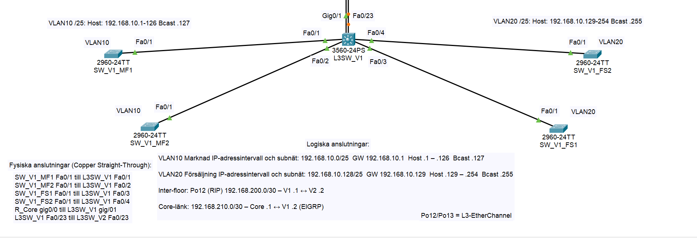
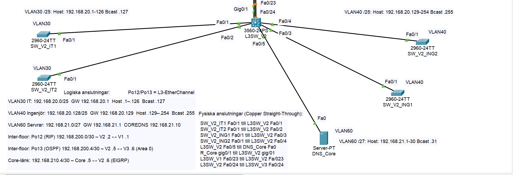
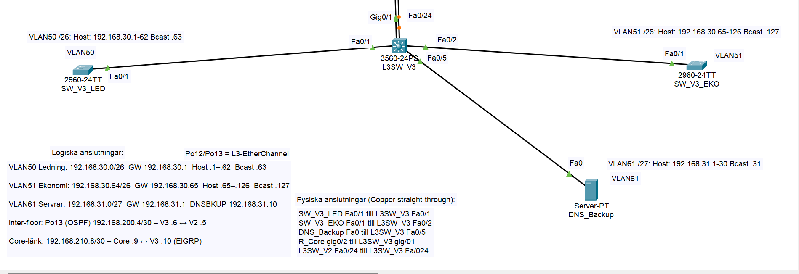
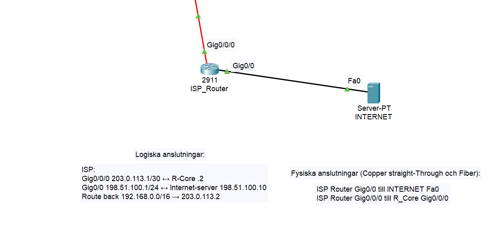

# GlobalTech Solutions - Enterprise Network Design

## 📌 Project Overview
In this project, I designed a complete network infrastructure for a made-up company called "GlobalTech Solutions". The goal was to build a network that is secure, redundant, and segmented across three different floors.

**My thoughts behind the design:**
I decided to use **/25 subnets** for Floors 1 and 2, and a **/26 subnet** for Floor 3. Even though this uses more addresses, I wanted to ensure that every department has at least **25% extra capacity** to grow in the future without having to rebuild the network.

## 🏗️ How it's built
The network is supposed to look like a real corporate building with a Core layer, Distribution layer, and Access layer.

* **Core:** A Cisco 2911 Router (`R_Core`) that handles the connection to the Internet (ISP).
* **Distribution:** Layer 3 Switches (3560) that handle routing between the different floors.
* **Access:** Cisco 2960 switches where all computers and printers are connected.
* **Redundancy:** I configured EtherChannels (LACP) between the switches so that if one cable breaks, the network keeps working.

## 📡 IP & VLAN Structure
I separated the departments into different VLANs to improve security and performance.

| Floor | VLAN | Department | Subnet | Gateway |
| :--- | :--- | :--- | :--- | :--- |
| **Floor 1** | 10 | Marketing | 192.168.10.0/25 | .1 |
| | 20 | Sales | 192.168.10.128/25 | .129 |
| **Floor 2** | 30 | IT Dept | 192.168.20.0/25 | .1 |
| | 40 | Engineering | 192.168.20.128/25 | .129 |
| | 60 | Servers (DNS Core) | 192.168.21.0/27 | .1 |
| **Floor 3** | 50 | Management | 192.168.30.0/26 | .1 |
| | 51 | Finance | 192.168.30.64/26 | .65 |
| | 61 | Servers (Backup) | 192.168.31.0/27 | .1 |

## 🔀 Routing Choices
To make the lab more interesting (and challenging), I used different routing protocols for different parts of the network.

**The "Translator" (Floor 2)**
The Switch on Floor 2 (`L3SW_V2`) is the heart of the routing. It acts as a translator that lets the different protocols talk to each other (Redistribution).

1.  **EIGRP (Core):** I chose EIGRP for the central parts because it's very fast and easy to manage on Cisco equipment.
2.  **OSPF (Floor 3):** Standard protocol used for the connection to the Management floor.
3.  **RIP v2 (Floor 1):** I used RIP for the link to Floor 1.
    * *Note: I know RIP is rarely used in large modern networks, but it was required for the school assignment.*

## 🛡️ Security & Services
* **SSH:** Enabled on all devices so I can manage them securely remotely.
* **NAT/PAT:** Configured on the Core Router to translate internal IP addresses to a public one, allowing internet access.
* **DNS:** I set up a Primary DNS on Floor 2 and a manually mirrored Backup DNS on Floor 3.

## 🚀 How to Run
1.  Download the `.pkt` file from this repository.
2.  Open it in **Cisco Packet Tracer** (Use version 8.2 because the file doesn't work with 9.0).
3.  Try pinging from a PC in "Marketing" to the "Internet Server" to see that the routing works.

## 📷 Detailed Views
### Floor 1 (Marketing & Sales)

### Floor 2 (IT & Engineering)

### Floor 3 (Management & Server Farm)

### ISP Connection

---
*Created by [Jesper Nilsson](https://github.com/JeNilSE)*
